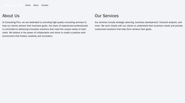
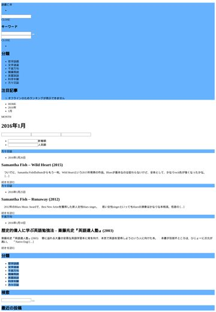
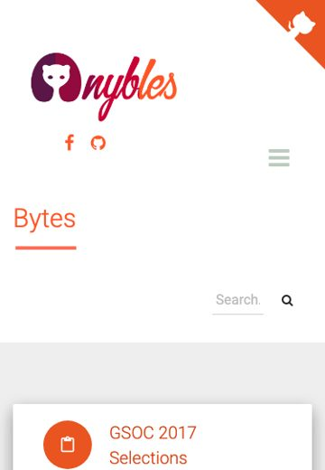
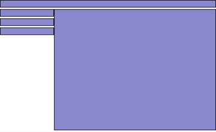

# Датасеты Screenshot2Code — сводный обзор

Единая точка правды по всем корпусам трека: масштаб, сложность, роль, бюджет
`max_length`. Числа собраны из EDA-ноутбуков (`webcode2m.ipynb`, `websight.ipynb`,
`webui.ipynb`) и стримингового прогона Web2Code (`web2code_stream_json.py`).
Методика метрик — [`required_data.md`](required_data.md), особенности и расхождения —
[`dataset_notes.md`](dataset_notes.md), токенайзер — `Qwen/Qwen3-VL-8B-Instruct`
(`token_len.py`), выборка на метрики 2–6 — случайная (`shuffle(seed=0)` + `SAMPLE_SIZE=5000`;
метрика 1 — точная по сплиту).

> ⚠ Токены Qwen 2.5/3/3.5 практически совпадают — `Qwen3-VL-8B` валидный прокси до
> фиксации точной модели (SFT зафиксировал `Qwen/Qwen3.5-9B`, `max_length=8192`).

---

## 1. Мастер-таблица train-кандидатов

| Метрика | **WebSight v0.2** | **WebCode2M** | **WebUI** | **Web2Code** |
|---|---|---|---|---|
| **HF** | `HuggingFaceM4/WebSight` | `xcodemind/webcode2m_purified` | `ronantakizawa/webui` | `MBZUAI/Web2Code` |
| **Тип** | синтетика (Tailwind) | реальный краул (purified) | реальные сайты/компоненты | синтетика (GPT-3.5/4) |
| **1. Примеров (train)** | 1 922 671 | 2 562 069 | 29 409 ¹ | 1 179 626 ² |
| **2. Языки** | EN (синтетика, `lang=unknown`) | **19** (en 52% · es · de · zh · fr…) | 1 (EN) + категор.³ | EN (синтетика) |
| **3. Код, токены** median / p99 | 418 / 835 ⁴ | 3 844 / 10 114 | 3 052 / 171 851 ⁵ | 669 / 1 214 |
| **4. DOM-узлы** median / mean | 27 / 28 | 233 / 247 | 66 / 145 | 45 / 50 |
| **5. Скриншот, W×H** | 2560×1440 (H плавает) | 1280×~1604 (H плавает) | 3 вьюпорта ⁶ | 1280×плавает ⁷ |
| **6. CSS правила** median / mean | ≈0 ⁸ | 106 / 157 декл. | 30 / 489 декл. | 21 / 24 декл. |
| **Визуальные токены** ⁹ | 1 672 | 1 672 | 1176 / 1003 / 388 | ~1176–1672 |
| **Бюджет max_length** (код p99 + картинка) | 896 сырой / **~5 500 боевой** ¹⁰ | **~11 800** | >8 000 (хвост) | **~2 900** |
| **Роль в пайплайне** | **SFT drafting MVP** | pretrain (реальные, управляемые) | для MVP не берём (хвост) | pretrain-tier / доп. |

¹ WebUI = 3 строки на `sample_id` (по вьюпорту), реальных страниц ~9.8k. · ² Из статьи (arXiv:2406.20098); наш стрим-прогон — 5000 распарсенных. · ³ 28 `source_name`, 4 `framework`, 6 `css_framework`, 23 `component_type`. · ⁴ Сырой источник; **боевой drafting-таргет после `precompile_tailwind`** — median 2321 / p99 3815 (Tailwind вкомпилирован в `<style>`). · ⁵ Тяжёлый хвост из инлайнового CSS дизайн-систем (не base64); cap 8192 оставляет ~75%. · ⁶ desktop 1280×720 · tablet 768×1024 · mobile 375×812. · ⁷ Картинки в `Web2Code_image.zip` (~30 ГБ), в стриме `image` — путь; выборка из `WebSight_images_new/` — рендеры 1280×переменная высота (≥1.31M px → те же 1672 визуальных токена). · ⁸ Стиль в Tailwind-утилити-классах, не в `<style>` — метрика 6 для Tailwind неинформативна. · ⁹ Оценка `qwen_image_tokens` (`convert_lib.py`): площадь зажата в `[256·32², 1280·32²]`, 1 токен ≈ 28×28 px → десктоп-скрин упирается в потолок **1672**. · ¹⁰ Код p99 (боевой 3815) + картинка 1672 ≈ 5487 → рабочий ~6144, влезает в окно SFT 8192.

**Главный вывод по бюджету.** В окно `max_length=8192` уверенно влезают **WebSight-drafting**
(~5.5k) и **Web2Code** (~2.9k). **WebCode2M** (~11.8k) и **WebUI** (хвост до ~172k токенов)
без фильтра по токенам **не влезают** — для них обязателен де-блоб + отсечка по бюджету
(см. правило гигиены в [`dataset_notes.md`](dataset_notes.md)).

---

## 2. Датасеты по одному (с примерами)

### WebSight v0.2 — SFT drafting MVP
Чистая синтетика на Tailwind (2560×1440, картинки-плейсхолдеры). Простые страницы:
DOM ~27, код короткий. Выбран источником drafting-таргета (конвертер — `../drafting/`).

  

### WebCode2M — реальные, управляемые
Реальный краул (purified), 1280×переменная высота, 19 языков, плотнее (DOM ~254,
CSS-декларации ~173). Основной кандидат в pretrain на «реальное шумное знание».

  

### WebUI — реальные компоненты, но тяжёлый хвост
Реальные сайты/компоненты дизайн-систем, 3 вьюпорта, богатые категориальные поля
(`framework`/`css_framework`/`component_type`, bbox'ы). Хвост длины (p99≈172k токенов)
делает его непригодным без жёсткого фильтра → для MVP откладываем.

  

### Web2Code — синтетика уровня WebSight
Инструкционный формат LLaVA (`conversations`: `human` = `<image>`+инструкция,
`gpt` = HTML). Простые страницы: код median 669 / p99 1214 токенов, DOM ~45, CSS ~21.
Картинки — в отдельном `Web2Code_image.zip` (~30 ГБ, 865k шт.
из под-источников `WebSight_images_new/`, `pix2code/`…); в стриме поле `image` — путь, не пиксели.
Примеры ниже выдернуты из архива по HTTP-range (`WebSight_images_new/`, рендеры **1280-широкие**).

  

---

## 3. Добавленные метрики

### 3.1 Визуальные токены (закрыт TODO `IMAGE_TOKEN_BUDGET`)

> ⚠ **Обновление 31 июля — Tier A.** `MAX_PIXELS` поднят `1280·32² → 2048·32²`
> (1.31 → 2.10 Мп): высокие реальные страницы при 1.31 Мп ужимались до ~10px текста
> (нечитаемо). Теперь десктоп-скрин упирается в **2048 визуальных токенов** (factor 32),
> а не 1672. Бюджет кода в окне 8192 при этом = 8192−2048−160 ≈ 5984. Анализ и таблицы
> читаемости — [`pixel_budget.py`](pixel_budget.py); числа ниже — для старого бюджета
> 1.31 Мп (factor 28, оставлены для истории).

Раньше все `max_length` считались с `IMAGE_TOKEN_BUDGET=0`. Реальный бюджет = код + картинка.
По `qwen_image_tokens` (конвенция SFT `MIN=256·32²`, `MAX=1280·32²`, patch 28):

| Вьюпорт | Пиксели | Визуальные токены |
|---|---|---|
| десктоп-скрин ≥ 1.31M px (WebSight, WebCode2M, drafting) | зажат в потолок | **1 672** |
| WebUI desktop 1280×720 | 921 600 | 1 176 |
| WebUI tablet 768×1024 | 786 432 | 1 003 |
| WebUI mobile 375×812 | 304 500 | 388 |

→ полноразмерный десктоп-скриншот стоит **1672 токена** сверх кода. Заложено в столбец
«Бюджет max_length» мастер-таблицы.

### 3.2 Распределение высоты скриншота
Ширина у WebSight/WebCode2M фиксирована, **высота плавает** — это и двигает визуальные токены:

| Датасет | W | H median | H p90 | H p99 | H max |
|---|---|---|---|---|---|
| WebSight v0.2 | 2560 | 1440 | — | — | ~2008 |
| WebCode2M | 1280 | 1604 | 2322 | 2560 | 3815 |
| WebUI | фикс. 3 вьюпорта | — | — | — | — |

Инструмент — `../drafting/height_dist.py` (читает высоту из PNG-заголовка без декодирования).
Для рендер-таргета: чем выше страница, тем больше визуальных токенов → отсечка по высоте
+ отсечка по коду задают общий бюджет.

---

## 4. Рекомендация по Web2Code

**Включить как pretrain-tier кандидата, не в SFT MVP.** Обоснование:
- **Дублирует WebSight по роли** — тоже синтетика (GPT-генерит HTML → рендер), сложность
  та же (median 669 токенов, DOM 45). Второй синтетик MVP не разблокирует; drafting уже на WebSight.
- **Дёшево влезает** в окно (~2.9k) — хороший «лёгкий» добавок в претрейн-микс (Этап 4).
- **Риск контаминации:** Web2Code — одновременно train (`Web2Code.json`) и бенч
  (`Web2Code_eval.jsonl`); при использовании держать декотаминацию train↔eval.
- **Картинки — 30 ГБ zip** отдельно; для претрейна тянуть только при реальном включении в микс.

Итог: в survey описан (числа выше — по реальным 5000 сэмплам), в микс — опционально на Этапе 4.

---

## 5. Бенчмарки (только eval, НИКОГДА в train — декотаминация)

| Бенч | Что | Масштаб | Лицензия/статус |
|---|---|---|---|
| **Design2Code** (`SALT-NLP/Design2Code-hf`) | реальные страницы, наш основной eval | 484 | наш рабочий бенч (метрики `visual_eval_v3`) |
| **Web2Code (eval-split)** | `Web2Code_eval.jsonl` + `_image_eval.zip` | 1.3 МБ / 50 МБ | eval-часть того же датасета |
| **Flame-React-Eval** | React-компоненты | — | arXiv:2503.01619 |
| **WebGen-Bench** | функциональные сайты | — | arXiv:2505.03733 |
| **Vision2Web** (`zai-org`) | L1 статич. / L2 интерактив / L3 фуллстек | 100 / 66 / 27 | CC-BY-NC-SA (eval-only) |
| **DesignBench** | generation / editing / repair, неск. фреймворков | — | arXiv:2506.06251 |
| **ScreenBench** | свежие реальные скриншоты + HTML | ~1000 | — |

Полный каталог с ссылками — [`../list_data.md`](../list_data.md).

---

## 6. Эксперименты и сетапы

> Полный план фазы 1–8 авг (гипотезы, контроль-эксперименты, свипы, сетапы,
> протокол) вынесен в [`experiments_plan.md`](experiments_plan.md). Ниже — краткий
> срез: зафиксированный сетап и уже прогнанные бенчи.

### SFT (`../../SFT/`)
- **Модель зафиксирована:** `Qwen/Qwen3.5-9B`, `max_length=8192`, LoRA r16, flash-attn2, DeepSpeed ZeRO-2.
- **Матрица конфигов** (`SFT/configs/`): `{full_ft, lora_ft}` × `{qwen2.5-vl-3b, qwen2.5-vl-7b, qwen3-vl-4b, qwen3-vl-8b, qwen3.5-4b, qwen3.5-9b, qwen3.5-27b}`.
- **Данные MVP:** только `task_type=="drafting"` (WebSight-конвертер).

### Eval (`../../Evaluation/`) — уже прогнано
Метрики `visual_eval_v3` (block / text / position / color / clip → `final_score`):

| Бенч | Модель | n | final | block | text | clip |
|---|---|---|---|---|---|---|
| Design2Code | Qwen-2.5-7B | 484 | 0.816 | 0.839 | 0.956 | 0.872 |
| Design2Code | Qwen-3.5-4B | 484 | 0.787 | 0.779 | 0.897 | 0.878 |
| Design2Code | Qwen-3.5-9B | 484 | **0.852** | 0.851 | 0.951 | 0.893 |
| WebSight70k | 3.5-4B | 57 996 | 0.868 | 0.874 | 0.970 | 0.900 |
| WebSight70k | 3.5-9B | 37 999 | **0.878** | 0.896 | 0.979 | 0.898 |

### Что запланировано (из `../PLAN.md`)
- Этап 2 — детерминированный рендерер (переиспользуем eval: Design2Code + Playwright).
- Этап 3 — reverse-construction синтетика (polishing / editing).
- Этап 4 — претрейн-микс WebCode2M + WebSight + Web2Code к единому формату пар.

---

## 7. Открытые пункты
- [ ] Согласовать `TARGET_SIZE`/вьюпорт скриншота между Data ↔ SFT ↔ eval (см. `PLAN.md §4`).
- [ ] Численный конфликт `max_length`: SFT=8192 vs WebCode2M ~11.8k → фильтр по токенам для реальных.
- [ ] Web2Code: решить, включать ли в претрейн-микс Этапа 4 (тянуть 30-ГБ картинки).
- [ ] WebSight height p90/p99 — доснять `height_dist.py` (сейчас только median/max).
