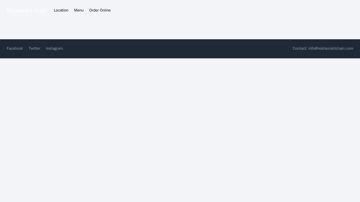
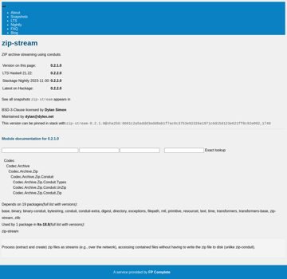
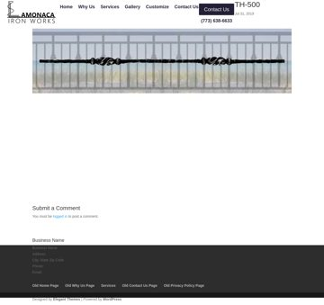
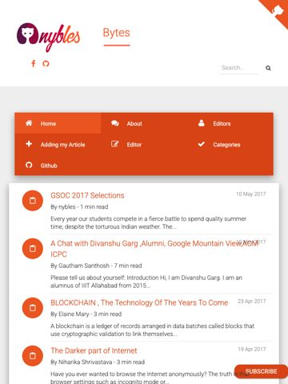
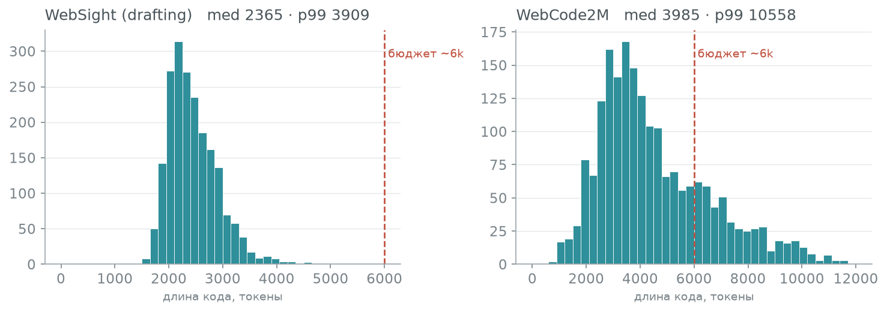
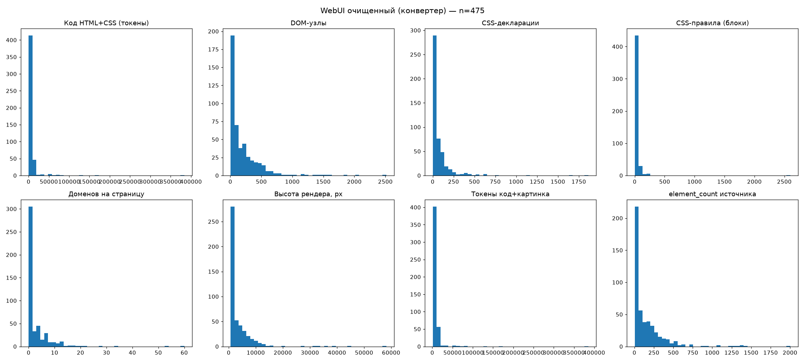

# Датасеты Screenshot2Code — сводный обзор

Единая точка правды по всем корпусам трека: масштаб, сложность, роль, бюджет
`max_length`. Числа собраны из EDA-ноутбуков (`webcode2m.ipynb`, `websight.ipynb`,
`webui.ipynb`) и стримингового прогона Web2Code (`web2code_stream_json.py`).
Методика метрик — [`required_data.md`](required_data.md), особенности и расхождения —
[`dataset_notes.md`](dataset_notes.md), токенайзер — `Qwen/Qwen3-VL-8B-Instruct`
(`token_len.py`), выборка на метрики 2–6 — случайная (`shuffle(seed=0)` + `SAMPLE_SIZE=5000`;
метрика 1 — точная по сплиту).

> ⚠ Токены Qwen 2.5/3/3.5 практически совпадают — `Qwen3-VL-8B` валидный прокси до
> фиксации точной модели (SFT зафиксировал `Qwen/Qwen3.5-9B`).
>
> ⚠ **Окно — 16384**, а не 8192. Все конфиги `SFT/configs/*qwen3_5*.yaml` стоят на
> `max_length: 16384`; 8192 осталось только в легаси-конфиге
> `lora_ft_qwen3_vl_4b_webcode2m.yaml`. Ниже по тексту 8192 встречается в исторических
> абзацах — там это помечено.

---

## 1. Мастер-таблица train-кандидатов

| Метрика | **WebSight v0.2** | **WebCode2M** | **WebUI** | **Web2Code** |
|---|---|---|---|---|
| **HF** | `HuggingFaceM4/WebSight` | `xcodemind/webcode2m_purified` | `ronantakizawa/webui` | `MBZUAI/Web2Code` |
| **Тип** | синтетика (Tailwind) | реальный краул (purified) | реальные сайты/компоненты | синтетика (GPT-3.5/4) |
| **1. Примеров (train)** | 1 922 671 | 2 562 069 | 29 409 ¹ | 1 179 626 ² |
| **2. Языки** | EN (синтетика, `lang=unknown`) | **19** (en 52% · es · de · zh · fr…) | 1 (EN) + категор.³ | EN (синтетика) |
| **3. Код, токены** median / p99 | 418 / 835 ⁴ | 3 844 / 10 114 | 3 052 / 171 851 ⁵ | 669 / 1 214 |
| **3а. Код после конвертера** median / p99 / max | — | — | **2 670 / 72 849 / 383 564** ⁵ᵃ | — |
| **4. DOM-узлы** median / mean | 27 / 28 | 233 / 247 | 66 / 145 | 45 / 50 |
| **5. Скриншот, W×H** | 2560×1440 (H плавает) | 1280×~1604 (H плавает) | 3 вьюпорта ⁶ | 1280×плавает ⁷ |
| **6. CSS правила** median / mean | ≈0 ⁸ | 106 / 157 декл. | 30 / 489 декл. | 21 / 24 декл. |
| **Визуальные токены** ⁹ | 2 048 | 2 048 | 900 / 768 / 297 | ~900–2 048 |
| **Бюджет max_length** (код p99 + картинка) | 896 сырой / **~5 500 боевой** ¹⁰ | **~11 800** | сырой >8 000 (хвост) / боевой: p99 всё ещё **~74 900** (хвост не исчез, сменился источник) — окно 16384 держит 95.4% страниц, окно 8192 — 82.5% ⁵ᵃ | **~2 900** |
| **Роль в пайплайне** | **SFT drafting MVP** | pretrain (реальные, управляемые) | **кандидат: хвост от CSS снят tree-shaking'ом, остаточный хвост от DOM держит фильтр по бюджету** ⁵ᵃ | pretrain-tier / доп. |

¹ WebUI = 3 строки на `sample_id` (по вьюпорту), реальных страниц ~9.8k. · ² Из статьи (arXiv:2406.20098); наш стрим-прогон — 5000 распарсенных. · ³ 28 `source_name`, 4 `framework`, 6 `css_framework`, 23 `component_type`. · ⁴ Сырой источник; **боевой drafting-таргет после `precompile_tailwind`** — median 2321 / p99 3815 (Tailwind вкомпилирован в `<style>`). · ⁵ **Сырой источник.** Тяжёлый хвост — не base64 и не «стили страницы»: в WebUI CSS лежит **отдельной колонкой `css`**, и там весь стайлшит сайта (170–470 КБ на страницу в сотню узлов). Cap 8192 оставляет ~75%. · ⁵ᵃ **После конвертера `converters/webui/` (14 авг).** Tree-shaking оставляет только правила, которые Chromium реально применил при рендере: 468 КБ → 3.7 КБ CSS на странице дизайн-системы, **два порядка**. Медиана кода принятого набора (n=1 582 полный / n=475 замеренная подвыборка с реальными p99/max, `webui_clean_eda.py`, 18 авг) — 2 664 / 2 670 токенов. p99 = **72 849**, max = **383 564** — хвост остался, но его источник сменился с неприменённого CSS сайта на объективно DOM-тяжёлые страницы (пример: `github/page` на 715 узлов и почти неужатый CSS; серия `lapaninja/button` на 1200–2500 узлов при CSS около нуля). Разбор — [`../../docs/experiments/2026-08-14-webui-inline-and-complexity.md`](../../docs/experiments/2026-08-14-webui-inline-and-complexity.md), числа хвоста — §3.3 ниже. ⚠ Замер n=475 снят ДО починки бага `</style` (см. §3.3) — часть страниц с почти нулевым `css_chars` могла быть не ужата шейкингом, а обрезана им; заново не перепроверено. · ⁶ desktop 1280×720 · tablet 768×1024 · mobile 375×812. · ⁷ Картинки в `Web2Code_image.zip` (~30 ГБ), в стриме `image` — путь; выборка из `WebSight_images_new/` — рендеры 1280×переменная высота (≥2.10 Мп → тот же потолок 2048 визуальных токенов). · ⁸ Стиль в Tailwind-утилити-классах, не в `<style>` — метрика 6 для Tailwind неинформативна. · ⁹ Оценка `qwen_image_tokens` (`converters/websight/convert_lib.py`): площадь зажата в `[MIN_PIXELS, MAX_PIXELS]` = `[256·32², 2048·32²]` (те же переменные `SFT_MIN_PIXELS`/`SFT_MAX_PIXELS`, что читает `SFT/train/formatting.py`), 1 токен = 32×32 px → десктоп-скрин упирается в потолок **2048**, пол — **256**. ⚠ Прежнее число **1672** — старая конвенция: patch=28 на потолке 1.31 Мп; снято 18 августа вместе с самим потолком. Встретив 1672 в старых журналах, читай его как «до Tier A». · ¹⁰ Код p99 (боевой 3815) + картинка 2048 ≈ 5863 → рабочий ~5952, влезает в окно 16384 с большим запасом.

**Главный вывод по бюджету.** В рабочее окно `max_length=16384` влезают все четыре
источника по медиане, и с запасом — **WebSight-drafting** (~5.9k) и **Web2Code** (~3.3k).
Ограничение осталось на хвостах: у **WebCode2M** p99 кода ~10.1k плюс картинка, а у **WebUI**
хвост сохраняется даже ПОСЛЕ конвертера (p99 ~74.9k код+картинка, замер 18 авг, §3.3) —
tree-shaking снял CSS-хвост сырого источника (было ~172k), но DOM-тяжёлые страницы остаются,
и при окне 16384 барьер по бюджету всё равно снимает ~4.6% набора. Правило гигиены для
реальных данных прежнее и для WebUI обязательно, а не подстраховка: де-блоб data-URI +
отсечка по бюджету (см. [`dataset_notes.md`](dataset_notes.md)), считать по СУММЕ
«код + картинка».

> Историческая справка: до 14–18 августа этот абзац был написан под окно 8192 и потолок
> картинки 1672. Оба числа с тех пор изменились — окно поднято до 16384, потолок картинки
> до 2048.

⚠ **Обновление 14 августа — по WebUI вывод снят.** Хвост создавала колонка `css` со всем
стайлшитом сайта, и он убирается tree-shaking'ом (§ 2, WebUI). После конвертации медиана
кода — 2 664 токена, а при окне 16384 бюджет снимает всего **55 страниц из 1 582**: он
перестал быть ограничением. Ограничивают теперь другие вещи — дубли и полнота источника,
см. §3.3.

---

## 2. Датасеты по одному (с примерами)

### WebSight v0.2 — SFT drafting MVP
Чистая синтетика на Tailwind (2560×1440, картинки-плейсхолдеры). Простые страницы:
DOM ~27, код короткий. Выбран источником drafting-таргета (конвертер — `../converters/websight/`).

<p>
  
</p>

### WebCode2M — реальные, управляемые
Реальный краул (purified), 1280×переменная высота, 19 языков, плотнее (DOM ~254,
CSS-декларации ~173). Основной кандидат в pretrain на «реальное шумное знание».

<p>
  
</p>

### WebUI — реальные компоненты; хвост снят tree-shaking'ом
Реальные сайты/компоненты дизайн-систем, 3 вьюпорта, богатые категориальные поля
(`framework`/`css_framework`/`component_type`, bbox'ы).

~~Хвост длины (p99≈172k токенов) делает его непригодным без жёсткого фильтра → для MVP
откладываем.~~ **Снято 14 августа.** Хвост давала не вёрстка, а колонка `css`: в ней весь
стайлшит сайта, а не стили страницы. Обрезка по длине тут не работает (обрезанный стайлшит
ломает страницу), работает выбрасывание неприменившихся правил — три ступени, последняя по
`CSS.startRuleUsageTracking` из CDP. Результат: **468 073 → 3 752 символа CSS**, приёмка
рендером до/после p50 = 1.000, ни одна из 30 сверенных страниц не сломана.

**Что от источника доходит до набора** (прогон на 5 234 из 9 803 уникальных страниц):

| шаг | доля |
|---|---:|
| прошло приёмку конвертации | 80.0% |
| — отбраковано `unstyled` (в колонке `css` нет стилей разметки) | 18.5% |
| — отбраковано приёмкой (вёрстка поехала) | 1.4% |
| near-dup по хэшу нашего рендера | 47.1% |
| **уникальных на выходе** | **30.2%** |

⚠ Две границы источника, которые конвертер не лечит: 48% страниц — витрины **одного
компонента** (`component_type == "button"`), и у части страниц framework-CSS в источнике
просто нет (страница верна коду, но представляет сайт неверно). Подробности и замеры —
[журнал 14 августа](../../docs/experiments/2026-08-14-webui-inline-and-complexity.md) §2.2, §2.4b.

<p>
  
</p>

### Web2Code — синтетика уровня WebSight
Инструкционный формат LLaVA (`conversations`: `human` = `<image>`+инструкция,
`gpt` = HTML). Простые страницы: код median 669 / p99 1214 токенов, DOM ~45, CSS ~21.
Картинки — в отдельном `Web2Code_image.zip` (~30 ГБ, 865k шт.
из под-источников `WebSight_images_new/`, `pix2code/`…); в стриме поле `image` — путь, не пиксели.
Примеры ниже выдернуты из архива по HTTP-range (`WebSight_images_new/`, рендеры **1280-широкие**).

<p>
  
</p>

---

## 3. Добавленные метрики

### 3.1 Визуальные токены (закрыт TODO `IMAGE_TOKEN_BUDGET`)

Раньше все `max_length` считались с `IMAGE_TOKEN_BUDGET=0`. Реальный бюджет = код + картинка.
Считает `qwen_image_tokens` (`converters/websight/convert_lib.py`): площадь зажимается в
`[MIN_PIXELS, MAX_PIXELS]`, дальше 1 токен = 32×32 px. Конвертер читает **те же** переменные
окружения, что и `SFT/train/formatting.py` (`SFT_MIN_PIXELS` = 262 144, `SFT_MAX_PIXELS` =
2 097 152), поэтому разъехаться оценка и обучение больше не могут.

| Вьюпорт | Пиксели | Визуальные токены |
|---|---|---|
| десктоп-скрин ≥ 2.10 Мп (WebSight, WebCode2M, drafting) | зажат в потолок | **2 048** |
| WebUI desktop 1280×720 | 921 600 | 900 |
| WebUI tablet 768×1024 | 786 432 | 768 |
| WebUI mobile 375×812 | 304 500 | 297 |
| любая картинка ≤ 0.26 Мп | поднят до пола | 256 |

→ полноразмерный десктоп-скриншот стоит **2048 токенов** сверх кода. Бюджет кода в рабочем
окне 16384 = 16384 − 2048 − ~160 (шаблон) ≈ **14 176** — ровно то число, что стоит в
`converters/synth/build.py` (`CODE_BUDGET_TOKENS`).

> ⚠ **История числа 1672.** До Tier A (31 июля) потолок был `1280·32²` = 1.31 Мп, и при этом
> `qwen_image_tokens` делил площадь на 28² вместо 32² — отсюда 1 310 720 / 784 = **1672**.
> Tier A поднял потолок (высокие страницы при 1.31 Мп ужимались до ~10px текста, нечитаемо),
> patch починили на 32, но само число 1672 успело разойтись по документам и держалось в них
> до 18 августа. Где оно встречается в старых журналах — это «до Tier A», не текущий бюджет.
> Анализ читаемости и таблицы — [`pixel_budget.py`](tools/pixel_budget.py).

### 3.2 Распределение высоты скриншота
Ширина у WebSight/WebCode2M фиксирована, **высота плавает** — это и двигает визуальные токены:

| Датасет | W | H median | H p90 | H p99 | H max |
|---|---|---|---|---|---|
| WebSight v0.2 | 2560 | 1440 | — | — | ~2008 |
| WebCode2M | 1280 | 1604 | 2322 | 2560 | 3815 |
| WebUI | фикс. 3 вьюпорта | — | — | — | — |

Инструмент — `../converters/websight/height_dist.py` (читает высоту из PNG-заголовка без декодирования).
Для рендер-таргета: чем выше страница, тем больше визуальных токенов → отсечка по высоте
+ отсечка по коду задают общий бюджет.

### 3.3 Хвосты распределения кода

Мастер-таблица даёт median и p99; здесь то, что за ними. Все числа — с тех же
прогонов ноутбуков (выборка 5000, `shuffle(seed=0)`), что и остальная таблица.

| Датасет | median | p99 | **max** |
|---|---:|---:|---:|
| WebSight v0.2 (сырой) | 418 | 835 | **1 556** |
| WebCode2M | 3 844 | 10 114 | **14 234** |
| WebUI (сырой) | 3 052 | 171 851 | **363 819** |

<p></p>

Гистограмма — боевой drafting-таргет WebSight и WebCode2M по реальным данным
(`tools/plot_hist.py`, выборка 2000, пунктир — бюджет кода в окне 16384).

У WebUI хвост длиннее, чем видно по p99: **p90 = 39 366, p95 = 63 736,
p99.9 = 250 454**. Отсечка по бюджету оставляет от него: cap 8192 → 75.3%,
cap 16384 → 85.8%. ~~Именно поэтому WebUI не берётся в MVP.~~

⚠ **Все числа строки WebUI выше — про СЫРОЙ источник, то есть про колонку `css` со
стайлшитом сайта.** После конвертера (14 авг) распределение другое.

**Замерено 18 августа** (`eda/tools/webui_clean_eda.py` по staging-манифесту, n=475
успешно принятых и распарсенных страниц — не то же самое, что полный принятый набор
1 582 (§2 ниже), но медиана сходится: 2 670 против прежних 2 664):

| WebUI после конвертера | median | p90 | p95 | **p99** | **max** |
|---|---:|---:|---:|---:|---:|
| код (`code_tokens`) | 2 670 | 11 043 | 15 471 | **72 849** | **383 564** |
| код + картинка (`tokens_total`) | 4 284 | 12 964 | 17 520 | **74 897** | **385 612** |

| cap | остаётся |
|---|---:|
| 8 192 | 82.5% |
| 16 384 | 95.4% |
| 32 768 | 97.3% |

⚠ **Прежняя прикидка «барьер снимает 55 страниц из 1 582» (≈96.5% при окне 16384) была
близка для ЭТОГО порога — реально 95.4% — но создавала неверное впечатление, что
tree-shaking закрыл хвост целиком.** Это не так: p99 = 72 849 и max = 383 564 —
величины того же порядка, что у сырого источника (было 171 851 / 363 819). Отличие не в
том, что хвост исчез, а в том, ЧТО его теперь создаёт. У сырого источника это была колонка
`css` (стайлшит всего сайта); у конвертированного — то, что не лечит tree-shaking:
**DOM-тяжёлые страницы**. Три худших случая: `github/page` на 715 узлов, где CSS почти не
ужался (962 КБ из 1 089 КБ исходных — сайт использует почти весь свой стайлшит), и
россыпь `lapaninja/button` с 1 200–2 500 DOM-узлов при CSS около нуля (это не стили, а
сама разметка компонента). Раз причина сменилась с «неприменённый CSS» на «объективно
большая страница», барьер по бюджету (§«Отбор» в `converters/complexity/README.md`) для
WebUI остаётся ОБЯЗАТЕЛЬНЫМ, а не подстраховкой: при окне 16384 он снимает не 55 страниц
из 1582 (3.5%), а по факту ближе к 4.6%, и при 8192 — уже 17.5%.

⚠ **Найден, починен и проверен на реальных данных баг конвертера — числа выше им НЕ
затронуты.** `build_html` (`converters/webui/convert_lib.py`) собирает CSS живых сайтов
в один `<style>` без защиты от буквальной подстроки `</style` внутри самого CSS.
HTML-токенайзер закрывает `<style>` по этой подстроке независимо от CSS-синтаксиса
(внутри строки, внутри комментария — без разницы), хвост стайлшита вытекает в тело
страницы как видимый текст, а `accept_page` (шаг 6) этого не ловит: «до» и «после»
шейкинга ломаются ОДИНАКОВО (оба через один `build_html`), `pixel_sim`=1.0, приёмка
проходит молча. Починка — `cssprune.guard_style_close`, регрессия —
`tests/test_cssprune.py` (воспроизведена и проверена на реальном Chromium).

**Проверка (19 авг).** Полный скан всех 9 803 строк `webui_desktop.jsonl.gz` на
буквальную `</style` (с границей тега) — совпадение нашлось **в одной странице из 9 803**
(`7318d3901dcb`, codepen/button, 0.01%). Сконвертирована с фиксом и без (эмуляция
старого поведения), обе версии отрендерены в Chromium: триггер сидит на 99.9% длины CSS
(артефакт скрейпинга источника: закрывающий `</style>` оригинальной страницы попал в
колонку `css` как текст), после него — 1 символ, так что визуально страницы идентичны —
для НЕЁ фикс ничего не менял, но для будущих страниц с триггером посреди стайлшита
(синтетический тест это воспроизводит) защита нужна.

Отдельно перепроверены все 15 страниц из `webui_clean_features.csv` с подозрительным
паттерном (заметный `css_chars_src`, почти нулевой `css_chars` после шейка) — например
`ea587c11de5e` / `sap-fundamental-styles` (172 858 → 17). Ни в одной из 15 подстроки
`</style` в сырых `html`/`css` не было вовсе (проверено по `webui_desktop.jsonl.gz`), а
пересборка тех же 15 страниц свежим конвертером даёт тот же результат — почти нулевой
CSS ПОСЛЕ ПРЕФИЛЬТРА (`css_len_pre`), то есть ещё ДО браузера/CDP, где и мог бы сработать
баг. Это не обрезка, а уже задокументированный паттерн «стайлшит не содержит стилей
разметки» (сноска ⁵ᵃ выше, `sap-fundamental-styles`). **Числа §1 и §3.3 выше проверены и
подтверждены** — перегонять корпус целиком заново не требуется.

<p></p>

Гистограмма — реальное распределение конвертированного набора (`webui_clean_eda.py`,
n=475). Длинный хвост читается прямо на графике — это те самые DOM-тяжёлые страницы,
а не артефакт биннинга.

⚠ **Расхождение:** в ноутбуке `webui.ipynb` уникальных `source_name` вышло **30**
(топ: github 2246, codepen 1563, sap-fundamental-styles 237, orbit-kiwi 112),
а в сноске ³ мастер-таблицы стоит 28. Какое верно — не проверялось;
см. [`../../docs/experiments/DIVERGENCES.md`](../../docs/experiments/DIVERGENCES.md).

> ⚠ Числа в скобках — **счёт строк, а не страниц**: у WebUI три строки на `sample_id`,
> так что страниц там втрое меньше (github ~749, codepen ~521). Само `nunique` от этого
> не зависит, поэтому спор «28 или 30» дедуп не решает. С 18 августа ноутбук считает
> категориальные счётчики по `pages` (§7a), и после перепрогона числа в скобках надо
> обновить.

---

## 4. Рекомендация по Web2Code

**Включить как pretrain-tier кандидата, не в SFT MVP.** Обоснование:
- **Дублирует WebSight по роли** — тоже синтетика (GPT-генерит HTML → рендер), сложность
  та же (median 669 токенов, DOM 45). Второй синтетик MVP не разблокирует; drafting уже на WebSight.
- **Дёшево влезает** в окно (~2.9k) — хороший «лёгкий» добавок в претрейн-микс (Этап 4).
- **Риск контаминации:** Web2Code — одновременно train (`Web2Code.json`) и бенч
  (`Web2Code_eval.jsonl`); при использовании держать декотаминацию train↔eval.
- **Картинки — 30 ГБ zip** отдельно; для претрейна тянуть только при реальном включении в микс.

Итог: в survey описан (числа выше — по реальным 5000 сэмплам), в микс — опционально на Этапе 4.

---

## 5. Бенчмарки (только eval, НИКОГДА в train — декотаминация)

| Бенч | Что | Масштаб | Лицензия/статус |
|---|---|---|---|
| **Design2Code** (`SALT-NLP/Design2Code-hf`) | реальные страницы, наш основной eval | 484 | наш рабочий бенч (метрики `visual_eval_v3`) |
| **Web2Code (eval-split)** | `Web2Code_eval.jsonl` + `_image_eval.zip` | 1.3 МБ / 50 МБ | eval-часть того же датасета |
| **Flame-React-Eval** | React-компоненты | — | arXiv:2503.01619 |
| **WebGen-Bench** | функциональные сайты | — | arXiv:2505.03733 |
| **Vision2Web** (`zai-org`) | L1 статич. / L2 интерактив / L3 фуллстек | 100 / 66 / 27 | CC-BY-NC-SA (eval-only) |
| **DesignBench** | generation / editing / repair, неск. фреймворков | — | arXiv:2506.06251 |
| **ScreenBench** | свежие реальные скриншоты + HTML | ~1000 | — |

Полный каталог с ссылками — [`../list_data.md`](../list_data.md).

---

## ⏱ Скорость обучения — калькулятор времени

Время обучения — произведение множителей. Меняешь число — сразу видно длительность.

```
T ≈ (N × E / g) × t_s
```

| Множитель | Что | В базовом ране |
|---|---|---|
| **N** | train-сэмплов (после фильтров) | ~5 370 |
| **E** | эпох | 3 |
| **g** | число GPU | 4 |
| **t_s** | сек на 1 сэмпл на 1 GPU (fwd+bwd) | **≈ 2.3 с** |

**Якорь (замер):** `t_s ≈ 2.3 с` на 4×A100, Qwen3-VL-4B, LoRA, WebCode2M (seqlen ≤ 8192 —
замер снят на прежнем окне, для 16384 линейно пересчитывать по строке seqlen ниже).
Вывод: `9376 с × 4 карты / (5370 × 3 сэмпла) = 2.33 с`. Проверка формулы:
`5370 × 3 / 4 × 2.3 = 9263 с ≈ 2 ч 34 мин` (факт 9376 с = 2 ч 36 мин, разница — eval + старт).

**`t_s` меняется от (относительно якоря 2.3 с):**

| Фактор | ×t_s |
|---|---|
| Модель 4B → 8B | ×~2 (линейно по параметрам); 27B ×~5–6 |
| full FT вместо LoRA | ×~1.5 |
| Датасет короче (WebSight, med ~2.3k кода) вместо WebCode2M | ×~0.4–0.5 |
| seqlen (реальная средняя длина) | пропорционально; для WebCode2M@8192 уже зашито в 2.3 с |

**Важно:** `per_device_train_batch_size` и `gradient_accumulation_steps` в формуле НЕТ — они
**не меняют общее время** (обучение compute-bound), только память и эфф.батч/LR. Крутишь время
только через **N, E, g, модель, длину датасета**.

**Примеры (подставь и посчитай):**
- Тот же ран на 8 картах: `9263 × 4/8 = 4631 с ≈ 1 ч 17 мин`.
- 10k сэмплов, 2 эпохи, 4 карты: `10000 × 2 / 4 × 2.3 = 11 500 с ≈ 3 ч 12 мин`.
- Qwen3-VL-8B, тот же датасет: `9263 × 2 ≈ 5 ч 9 мин`.

**Проверка по шагам** (для сверки с прогресс-баром): `шагов = N × E / (b·a·g)`, каждый шаг
`≈ a × 9.3 с` (в базе: `252 шага × 37 с`). Инференс-сравнение (мердж + gen N моделей) — отдельно,
~3–4 мин на модель + ~2–3 мин на мердж.

---

## 6. Эксперименты и сетапы

> Полный план фазы 1–8 авг (гипотезы, контроль-эксперименты, свипы, сетапы,
> протокол) вынесен в [`../../docs/ROADMAP.md`](../../docs/ROADMAP.md). Ниже — краткий
> срез: зафиксированный сетап и уже прогнанные бенчи.

### SFT (`../../SFT/`)
- **Модель зафиксирована:** `Qwen/Qwen3.5-9B`, `max_length=16384`, LoRA r16, flash-attn2, DeepSpeed ZeRO-2.
  (16384 стоит во всех `SFT/configs/*qwen3_5*.yaml`; 8192 осталось только в легаси-конфиге
  `lora_ft_qwen3_vl_4b_webcode2m.yaml`.)
- **Матрица конфигов** (`SFT/configs/`): `{full_ft, lora_ft}` × `{qwen2.5-vl-3b, qwen2.5-vl-7b, qwen3-vl-4b, qwen3-vl-8b, qwen3.5-4b, qwen3.5-9b, qwen3.5-27b}`.
- **Данные MVP:** только `task_type=="drafting"` (WebSight-конвертер).

### Eval (`../../Evaluation/`) — уже прогнано
Метрики `visual_eval_v3` (block / text / position / color / clip → `final_score`):

| Бенч | Модель | n | final | block | text | clip |
|---|---|---|---|---|---|---|
| Design2Code | Qwen-2.5-7B | 484 | 0.816 | 0.839 | 0.956 | 0.872 |
| Design2Code | Qwen-3.5-4B | 484 | 0.787 | 0.779 | 0.897 | 0.878 |
| Design2Code | Qwen-3.5-9B | 484 | **0.852** | 0.851 | 0.951 | 0.893 |
| WebSight70k | 3.5-4B | 57 996 | 0.868 | 0.874 | 0.970 | 0.900 |
| WebSight70k | 3.5-9B | 37 999 | **0.878** | 0.896 | 0.979 | 0.898 |

### Что запланировано (из `../PLAN.md`)
- Этап 2 — детерминированный рендерер (переиспользуем eval: Design2Code + Playwright).
- Этап 3 — reverse-construction синтетика (polishing / editing).
- Этап 4 — претрейн-микс WebCode2M + WebSight + Web2Code к единому формату пар.

---

## 7. Открытые пункты
- [ ] Согласовать `TARGET_SIZE`/вьюпорт скриншота между Data ↔ SFT ↔ eval (см. `PLAN.md §4`).
- [x] ~~Численный конфликт `max_length`: SFT=8192 vs WebCode2M ~11.8k~~ — снят: окно поднято
  до 16384, WebCode2M (код p99 10.1k + картинка 2048 ≈ 12.2k) влезает. Фильтр по бюджету
  всё равно держим — он нужен хвостам WebUI и сборной солянке, а не WebCode2M.
- [ ] Web2Code: решить, включать ли в претрейн-микс Этапа 4 (тянуть 30-ГБ картинки).
- [ ] WebSight height p90/p99 — доснять `height_dist.py` (сейчас только median/max).
